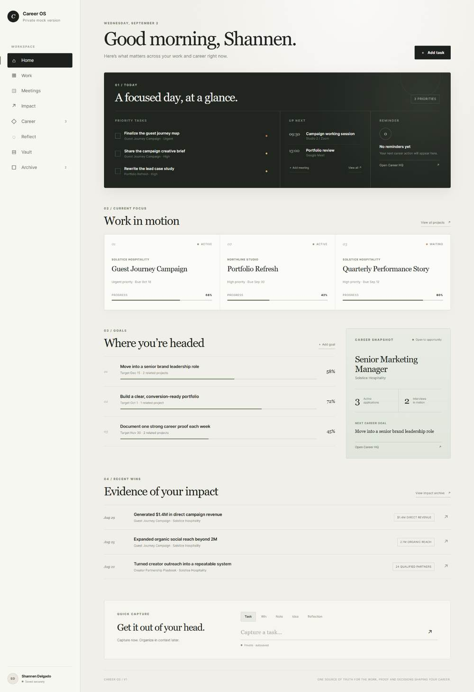
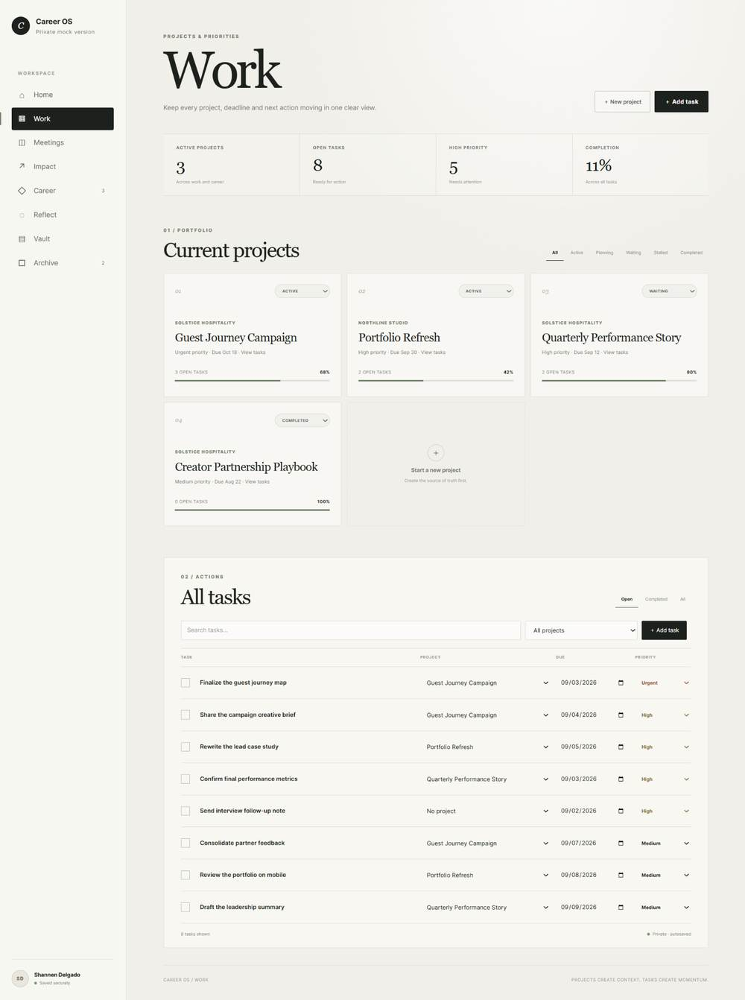
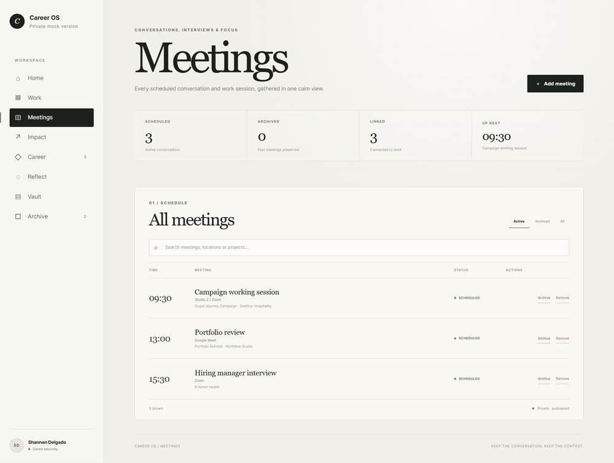
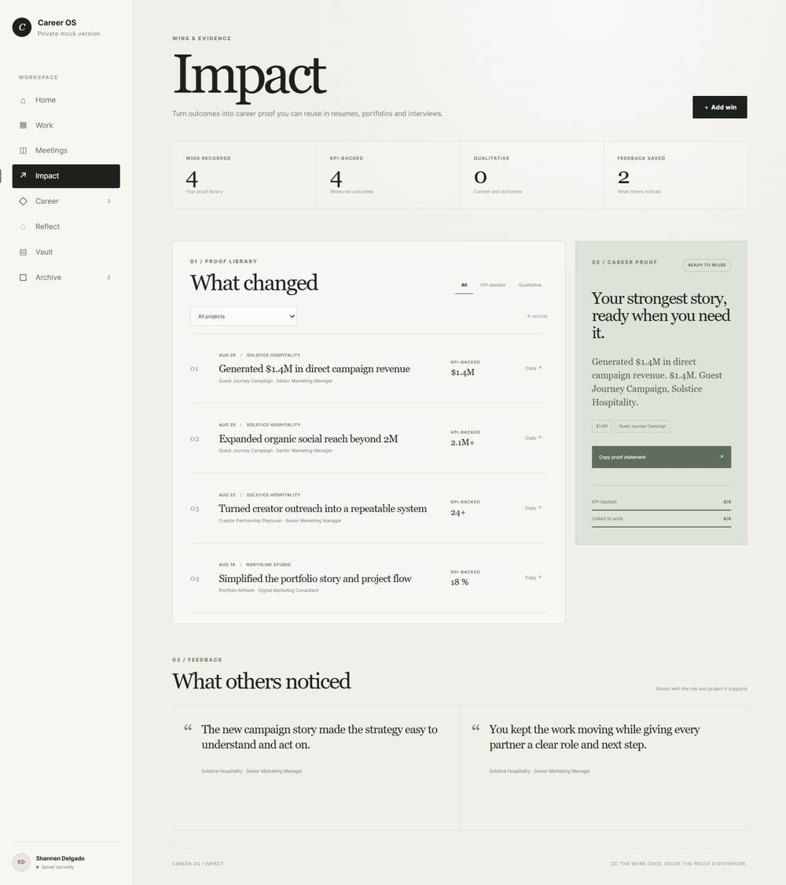
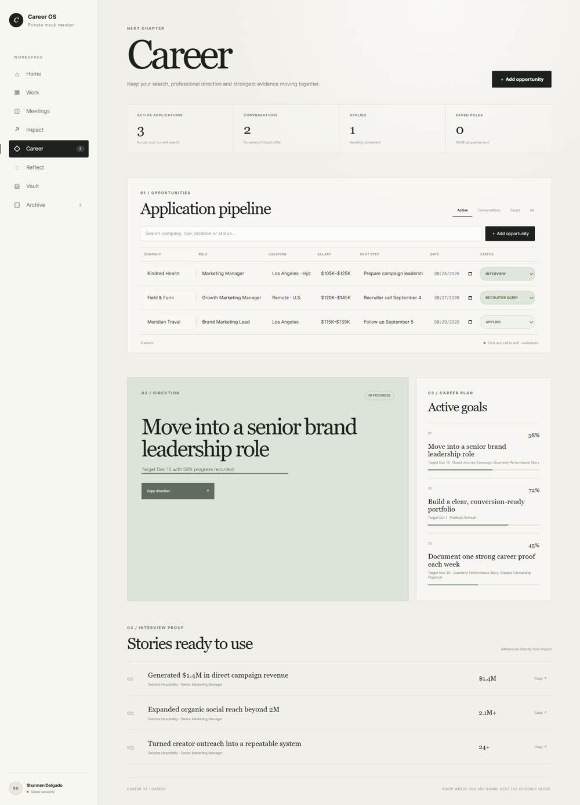
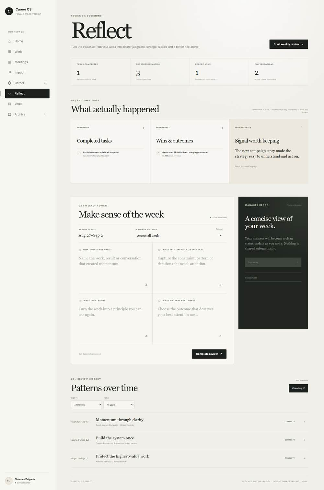
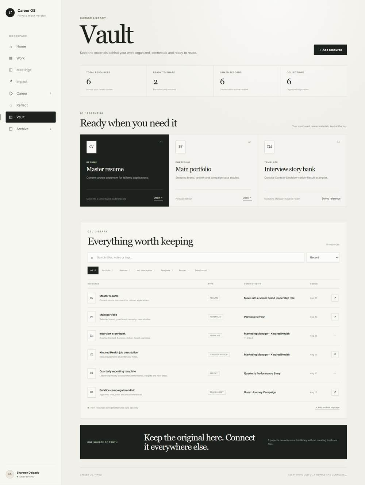
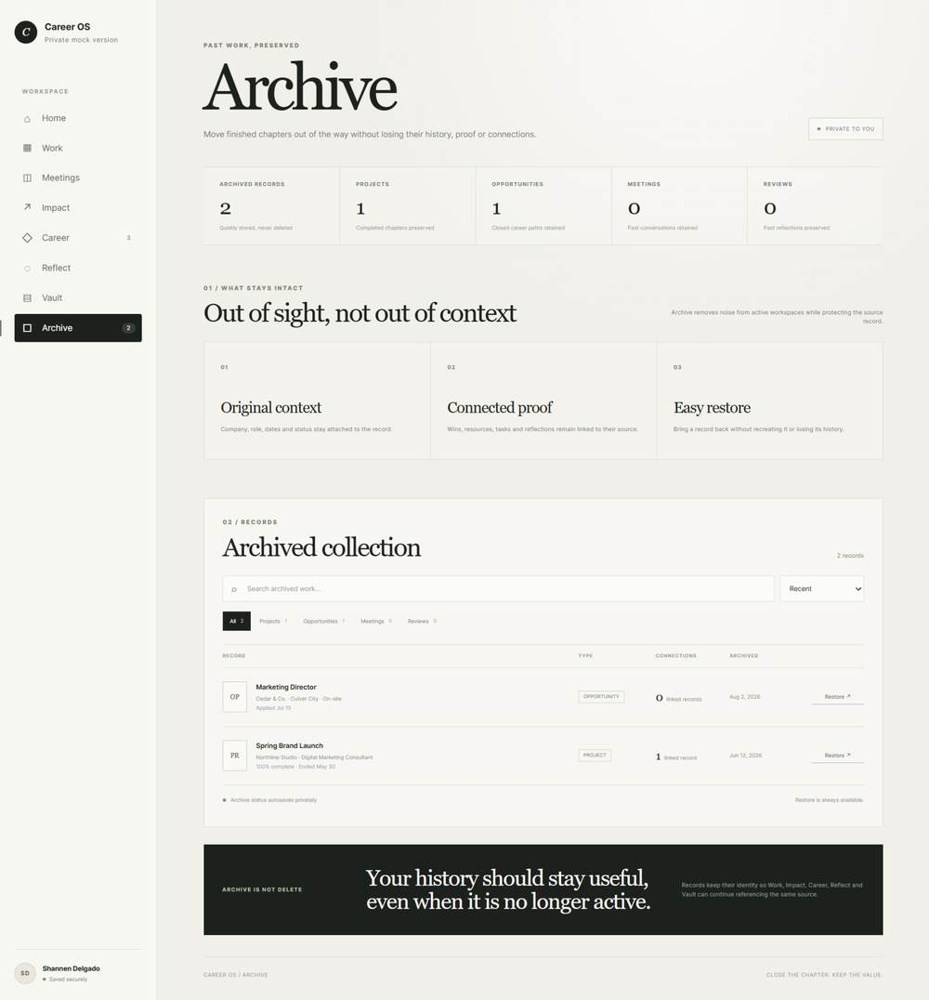
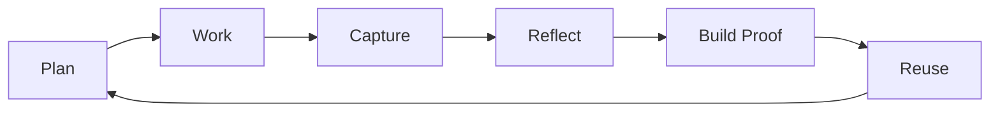
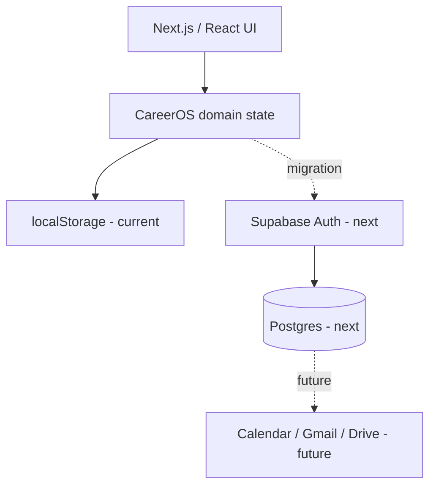

# CareerOS

### Your career, remembered.

A personal career operating system for turning everyday work into organized, reusable career proof.

CareerOS brings tasks, meetings, projects, wins, impact, resources, and professional positioning into one place—so the work you do today is easier to reflect on, communicate, and reuse later.

> **Portfolio project:** Product strategy · UX / information architecture · AI-assisted development · Next.js · TypeScript

[View the original product prototype](https://career-os.shndlgdo.chatgpt.site/mock)

---

## Product walkthrough

### Home

The command center brings priorities, meetings, current projects, career goals, recent impact, and quick capture into one focused view.



### Work

Projects and tasks live together so everyday execution keeps its larger context.



### Meetings

A dedicated meeting view keeps scheduled conversations visible and creates a foundation for notes, decisions, follow-ups, and project links.



### Impact

Wins and outcomes are separated from activity so the strongest evidence stays easy to find and reuse.



### Career

Applications, conversations, career direction, goals, and interview-ready proof stay connected rather than scattered across separate trackers.



### Reflect

Weekly reflection turns completed work, wins, and feedback into clearer judgment and reusable stories.



### Vault

Career materials are stored once, linked back to their context, and kept ready for applications, portfolios, and interviews.



### Archive

Finished work can leave the active workspace without losing its history, proof, or connections.



---

## Why I built it

Career information tends to disappear into scattered tools: notes, calendars, task managers, documents, screenshots, email threads, and memory.

That creates a second problem later. When it is time to update a resume, prepare for an interview, write a performance review, build a case study, or explain impact, the evidence is difficult to reconstruct.

I designed **CareerOS** around a different idea:

**career management should happen while the work is happening—not months later when you are trying to remember it.**

The product connects day-to-day execution with longer-term career storytelling.

---

## The product loop

**Plan → Work → Capture → Reflect → Build Proof → Reuse**

CareerOS is designed so that ordinary work can gradually become structured professional evidence.



For example, a task can belong to a project. A meeting can generate an action item. A completed initiative can become a win. A win can include measurable impact. That evidence can later support a resume bullet, interview story, portfolio case study, or performance review.

---

## What CareerOS includes

| Area | Purpose |
| --- | --- |
| **Home** | A command center for what matters now |
| **Work** | Projects and tasks organized around active priorities |
| **Meetings** | Keep conversations accessible beyond the calendar event |
| **Impact** | Track wins, outcomes, feedback, and measurable proof |
| **Career** | Applications, goals, direction, and interview-ready evidence |
| **Reflect** | Turn weekly activity into judgment, patterns, and next moves |
| **Vault** | Keep useful resources and career assets together |
| **Archive** | Remove items from active views without losing them |

### Current interaction details

- Working task completion controls
- Dedicated **All Meetings** view
- Archive, restore, and delete actions
- Responsive desktop and mobile shell
- Empty starting state—no fake demo records
- Local browser persistence while the production backend is being connected

---

## Product decisions

### 1. Start empty

Many dashboard prototypes look impressive because they are filled with fictional activity. CareerOS intentionally starts with **no placeholder data**.

The empty state is part of the product: the system should become useful because of the user's real work, not because the interface is pre-filled for presentation.

### 2. Separate active work from career proof

A task is not automatically an accomplishment.

CareerOS distinguishes between what needs to be done and what is worth remembering. This keeps everyday execution lightweight while creating a deliberate path for meaningful outcomes to become **wins and impact**.

### 3. Make meetings first-class records

A calendar is good at telling you *when* a meeting happened. It is less useful for preserving why it mattered.

CareerOS gives meetings their own space so they can eventually hold decisions, notes, people, follow-ups, and project context.

### 4. Archive before delete

Career records are often useful later, even when they are no longer active. Archive and restore behavior keeps the main workspace clean without forcing permanent deletion.

### 5. Build around reuse

The long-term value of the system is not simply organization. It is the ability to turn accumulated work into reusable material for:

- resumes
- interviews
- portfolios
- performance reviews
- promotion conversations
- professional positioning

---

## From prototype to product

CareerOS began as a rapid UX/product prototype in **ChatGPT Sites**. I used that environment to test the information architecture, dashboard structure, interactions, and empty-state behavior quickly.

Once the product direction became clear, I moved it into GitHub and rebuilt the experience as a maintainable application rather than treating the prototype as the final product.

That workflow let me separate two questions:

1. **What should the product be?**
2. **How should the production version be engineered?**

This repository is the production-oriented rebuild.

---

## My role

I own the project end to end across:

- product concept and problem framing
- feature prioritization
- information architecture
- UX flows and interaction decisions
- interface direction
- data-model thinking
- AI-assisted implementation
- QA and iteration
- roadmap definition

I use AI as a build partner for implementation and iteration, while retaining ownership of the product decisions, system design, requirements, and final output.

---

## Tech stack

| Layer | Technology |
| --- | --- |
| Framework | Next.js 16 · App Router |
| UI | React 19 |
| Language | TypeScript |
| Styling | Custom CSS design system |
| Current persistence | Browser `localStorage` |
| Planned backend | Supabase Auth + Postgres |
| Deployment target | Vercel |

---

## Architecture direction



The current local persistence layer lets the product be tested without shipping credentials or seeded demo content. The next implementation slice replaces that layer with authenticated, user-owned records in Supabase while preserving the product model.

---

## Roadmap

### Now

- [x] CareerOS product concept
- [x] Dashboard / navigation system
- [x] Task completion
- [x] Meetings index
- [x] Projects foundation
- [x] Win / impact capture
- [x] Archive and delete behavior
- [x] Empty-state product experience
- [x] Responsive app shell
- [x] GitHub production rebuild

### Next

- [ ] Supabase authentication
- [ ] Persistent user-owned records
- [ ] Project detail views
- [ ] Project-linked tasks, meetings, and wins
- [ ] Meeting notes, decisions, attendees, and action items
- [ ] KPI history and richer impact records
- [ ] Weekly Review and reflection flow
- [ ] Opportunities / Interview Mode

### Later

- [ ] Calendar integration
- [ ] Gmail integration
- [ ] Google Drive integration
- [ ] Meeting transcript ingestion
- [ ] AI-assisted career-proof extraction and reuse

---

## Run locally

```bash
npm install
npm run dev
```

Then open:

```text
http://localhost:3000
```

To verify the production build:

```bash
npm run build
npm run typecheck
```

---

## Privacy by default

Career data can include private work history, internal projects, interview material, and personal notes. CareerOS is therefore designed around a **private-by-default** model.

Secrets and environment files are excluded from Git. Supabase service keys and other private credentials should never be committed to this repository.

---

## Project status

**Active build.** The product shell and core interaction model are in place. The next major milestone is moving persistence from the browser to Supabase and deploying the GitHub version as the primary live demo.
